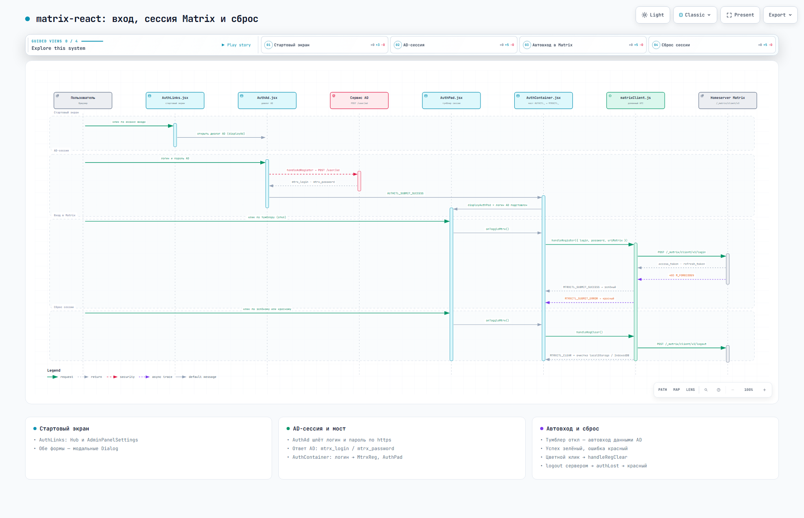

# matrix-react
ReactJS компоненты на базе [matrix-js-sdk](https://github.com/matrix-org/matrix-js-sdk)


Сборка — `npm run build` в `dist/` (каталог в git не хранится).

## Быстрый старт

Требуется Node.js 24.

```bash
npm install
npm run dev     # Vite dev-сервер: http://localhost:3000 (host 0.0.0.0)
npm run build   # сборка в dist
npm run serve   # предпросмотр сборки: http://localhost:4173 (vite preview, host 0.0.0.0)
npm run deploy  # сборка + выкладка dist на прод по rsync (deploy.sh) — только по явному запросу
```

Проверки и форматирование — Biome (`format` и `check` пишут правки в файлы):

```bash
npm run lint    # только проверка
npm run format  # форматирование с записью
npm run check   # линт + форматирование с записью
```

В dev-режиме Vite поднимает мок-API.


# Компоненты

## MtrxReg.jsx
Форма входа в Matrix.


## MtrxRoomList.jsx
Список комнат.


## MtrxRoom.jsx
Комната: шапка и таймлайн последних сообщений.


## MtrxDeviceVerification.jsx
E2EE: авторизация устройства — SAS по emoji или recovery key.


# Доп. компоненты
Плюшки для интеграции с внешними сервисами

## AuthAd.jsx
POST-запрос к серверу авторизации, ожидаемый ответ:
```json
{
  "ad_login"      : "login",
  "ad_cn"         : "ФИО",
  "ad_title"      : "Должность",
  "ad_department" : "Отдел",
  "mtrx_login"    : "matrix-login",
  "mtrx_password" : "matrix-password"
}
```


## AuthPad.jsx
Тумблер активирует сервис.


# Документация

[](https://ars-anosov.github.io/matrix-react/archify/matrix-react-architecture.html)

[](https://ars-anosov.github.io/matrix-react/archify/matrix-react-auth-sequence.html)

Все документы: <https://ars-anosov.github.io/matrix-react/>


# Пакеты

Зависимости — в `package.json`, установка — `npm install`. Обновление мажорных версий:

```bash
npx npm-check-updates
```

# Лицензия

MIT, см. [LICENSE](LICENSE).
