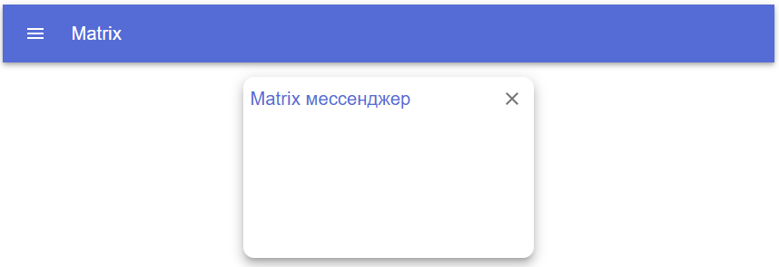

# matrix-react
ReactJS компоненты на базе [matrix-js-sdk](https://github.com/matrix-org/matrix-js-sdk)



Готовая сборка в [mtrx/dist](mtrx/dist)

```bash
cd mtrx
npm install
# npm run dev
npm run build
```


# Компоненты

## MsngrReg.jsx


# Доп. компоненты
Плюшки для интеграции с внешними сервисами

## AuthAd.jsx
POST-запрос к серверу авторизации, ожидаемый ответ:
```json
{
  "ad_login"      : "login",
  "ad_cn"         : "ФИО",
  "ad_title"      : "Должность",
  "ad_department" : "Отдел"
}
```


# Пакеты
Использую Node.js + Vite, см. [tools](tools)

node модули
```bash
npm install --save react react-dom react-router-dom
npm install --save react-redux redux redux-logger redux-thunk
npm install --save @mui/material @emotion/react @emotion/styled @mui/icons-material
npm install --save matrix-js-sdk ky
npm install --save-dev vite @vitejs/plugin-react body-parser

# Перепрыгнуть за мажорные версии
npx npm-check-updates
```

npm скрипты
```json
  "scripts": {
    "dev": "vite --host 0.0.0.0",
    "build": "vite build",
    "serve": "vite preview --host 0.0.0.0"
  }
```
