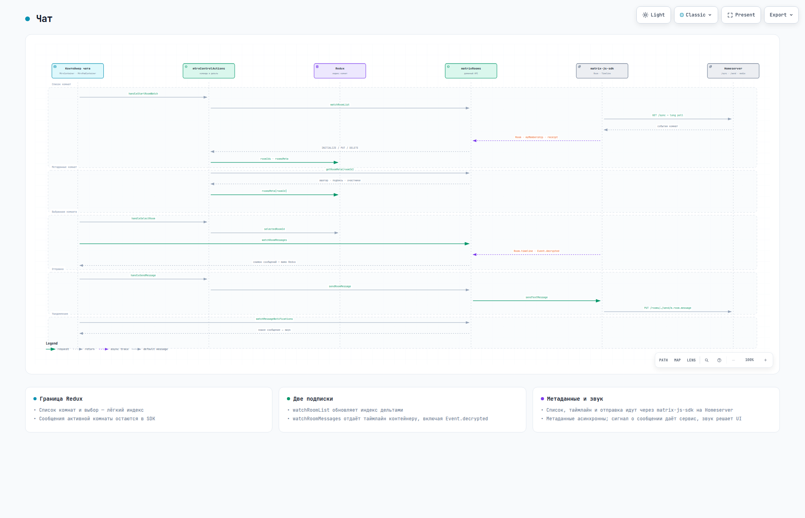

# matrix-react
ReactJS компоненты на базе [matrix-js-sdk](https://github.com/matrix-org/matrix-js-sdk)


Сборка — `npm run build` в `dist/` (каталог в git не хранится).

## Быстрый старт

Требуется Node.js 24.

```bash
npm install
npm run dev     # Vite dev-сервер: http://localhost:3000 (host 0.0.0.0)
npm run build   # сборка в dist
npm run serve   # предпросмотр сборки: http://localhost:4173 (vite preview, host 0.0.0.0)
npm run deploy  # сборка + выкладка dist на прод по rsync (deploy.sh) — только по явному запросу
```

Проверки и форматирование — Biome (`format` и `check` пишут правки в файлы):

```bash
npm run lint    # только проверка
npm run format  # форматирование с записью
npm run check   # линт + форматирование с записью
```

В dev-режиме Vite поднимает мок-API.

## Инструменты для диаграмм и UI-проверок в WSL (не нужны для запуска приложения)

Команды выполнять в **WSL Ubuntu** под Node.js 24, не в Windows и не с `sudo`. Глобальные
пакеты npm устанавливаются для текущей версии Node, выбранной `fnm`:

```bash
npm install -g @mermaid-js/mermaid-cli @playwright/cli
playwright-cli install-browser chromium
dsh plugin --profile web add @tt-a1i/archify-dsh@0.1.0
```

Проверить установку:

```bash
mmdc --version
playwright-cli --version
node "$HOME/.dsh/profiles/web/node_modules/@tt-a1i/archify-dsh/skills/archify/bin/archify.mjs" doctor
```

[Mermaid CLI](https://github.com/mermaid-js/mermaid-cli#installation) (`mmdc`) проверяет и
рендерит Mermaid; его Puppeteer-браузер **отдельный** от Chromium Playwright.
[Playwright CLI](https://github.com/microsoft/playwright-cli#installation) для UI-проверок
запускать через `.dsh/bin/browser` по навыку `ui-verify`: обёртка задаёт профиль и кэш браузера.
[Archify для DSH](https://github.com/tt-a1i/archify/blob/main/integrations/deepseek-harness/README.md#install)
ставится **в профиль `web`**, а не через глобальный npm; для визуальной проверки ему нужен
Linux-Chromium — порядок в навыке `archify-visual-check`.

# Компоненты

## MtrxReg.jsx
Форма входа в Matrix.


## MtrxPad.jsx
Мессенджер: список комнат, поле логина для нового чата и панель активной комнаты.

## MtrxRoomList.jsx
Список комнат: аватар, название, «Приглашение» или «Пространство», бейдж непрочитанного.
Строка списка фильтруется по логину из поля нового чата.


## MtrxRoom.jsx
Активная комната: шапка с аватаром и подписью, таймлайн последних сообщений, кнопка выхода.
Панель выбирает ветку: приглашение (`MtrxInvite`), пространство (`MtrxSpace`) или чат
с composer'ом.


### MtrxComposer.jsx
Ввод сообщения: Enter — отправка, Shift+Enter — перенос строки; при ошибке текст возвращается в поле.
Кнопка-скрепка прикладывает файл: он показывается строкой с именем и размером, отправка идёт с
прогрессом, а текст из поля становится подписью к вложению.

### MtrxAttachment.jsx
Вложение в таймлайне: картинка — превью (клик по ней тоже скачивает), остальные типы — карточка с
именем, размером и кнопкой скачивания; ошибка скачивания показывается рядом.

Файлы уходят в content repository (`services/matrixMedia.js`): тип сообщения выбирается по MIME
(`m.image` / `m.video` / `m.audio` / `m.file`), превью картинок запрашивается с авторизацией и
кэшируется. В шифрованной комнате файл шифруется AES-256-CTR до загрузки, а ключ и хэш шифротекста
уезжают в `content.file` события; при скачивании хэш проверяется, расшифровка идёт в браузере.

### MtrxInvite.jsx
Приглашение в комнату: «Принять» (`joinRoom`) или «Отклонить» (`leaveRoom`).

### MtrxLeaveRoom.jsx
Диалог подтверждения выхода из комнаты.

### MtrxSpace.jsx
Пространство `m.space`: список дочерних комнат, писать сообщения нельзя.

## MtrxDeviceVerification.jsx
E2EE: авторизация устройства — SAS по emoji или recovery key.


# Доп. компоненты
Плюшки для интеграции с внешними сервисами

## AuthAd.jsx
POST-запрос к серверу авторизации, ожидаемый ответ:
```json
{
  "ad_login"      : "login",
  "ad_cn"         : "ФИО",
  "ad_title"      : "Должность",
  "ad_department" : "Отдел",
  "mtrx_login"    : "matrix-login",
  "mtrx_password" : "matrix-password"
}
```


## AuthPad.jsx
Тумблер активирует сервис.


# Документация

[](https://ars-anosov.github.io/matrix-react/archify/matrix-react-architecture.html)

[](https://ars-anosov.github.io/matrix-react/archify/matrix-react-auth-sequence.html)

[](https://ars-anosov.github.io/matrix-react/archify/matrix-react-chat-flow.html)

Все документы: <https://ars-anosov.github.io/matrix-react/>


# Пакеты

Зависимости — в `package.json`, установка — `npm install`. Обновление мажорных версий:

```bash
npx npm-check-updates
```

# Лицензия

MIT, см. [LICENSE](LICENSE).

Звук нового сообщения `public/sounds/message.ogg` — из
[Material sound resources](https://m2.material.io/design/sound/sound-resources.html)
(© Google, [CC-BY 4.0](https://creativecommons.org/licenses/by/4.0/)); файл взят из
[Cinny](https://github.com/cinnyapp/cinny) (`public/sound/notification.ogg`), где он
распространяется на тех же условиях.
