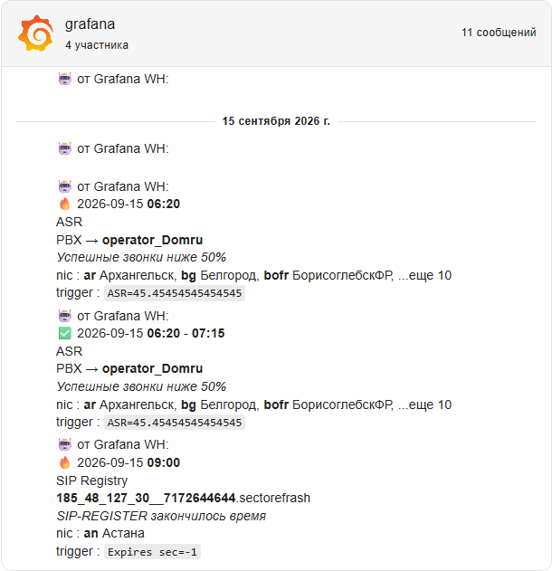
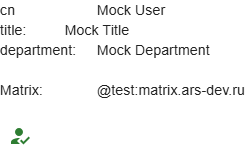
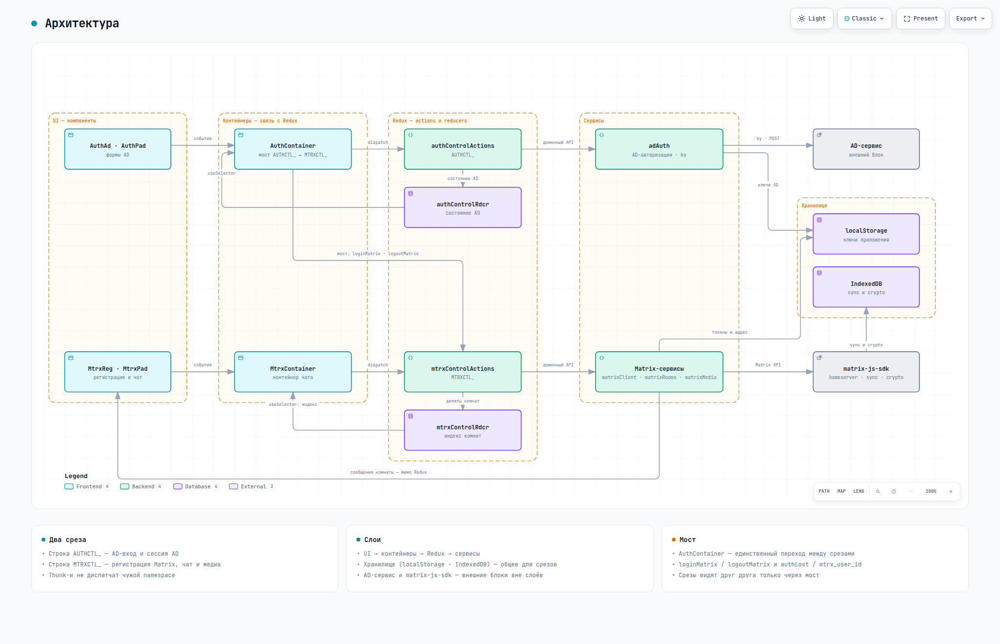

# matrix-react
ReactJS компоненты на базе [matrix-js-sdk](https://github.com/matrix-org/matrix-js-sdk)


Сборка в директорию dist

```bash
npm install
# npm run dev
npm run build
```


# Компоненты

## MtrxReg.jsx
Форма входа в Matrix (homeserver, логин, пароль) и выход из сессии.


## MtrxPad.jsx
Панель мессенджера: список комнат и последние сообщения выбранной комнаты.


## MtrxRoomList.jsx
Список комнат: аватар и имя, выбор активной комнаты.


## MtrxRoom.jsx
Комната: шапка (аватар, имя, подпись) и таймлайн последних сообщений.



## MtrxDeviceVerification.jsx
E2EE: авторизация устройства — SAS по emoji или recovery key.


## MenuAppBar.jsx
Верхнее меню: тумблеры панелей и данные AD-пользователя.


# Доп. компоненты
Плюшки для интеграции с внешними сервисами

## AuthAd.jsx
POST-запрос к серверу авторизации, ожидаемый ответ:
```json
{
  "ad_login"      : "login",
  "ad_cn"         : "ФИО",
  "ad_title"      : "Должность",
  "ad_department" : "Отдел",
  "mtrx_login"    : "matrix-login",
  "mtrx_password" : "matrix-password"
}
```


## AuthPad.jsx
Панель «Мост к сервисам»: тумблер сессии Matrix — откл (авторизация данными AD),
зелёный (сессия активна) и красный (авторизация потеряна).


## AuthAdInfo.jsx
Данные AD-пользователя: `ad_cn`, `ad_title`, `ad_department`, `ad_login`.




# Документация

[](https://ars-anosov.github.io/matrix-react/archify/matrix-react-architecture.html)

Все документы: <https://ars-anosov.github.io/matrix-react/>


# Пакеты

node модули
```bash
npm install --save react@^19.2.8 react-dom@^19.2.8 react-router-dom@^7.18.2
npm install --save react-redux@^9.3.0 redux@^5.0.1 redux-thunk@^3.1.0 redux-logger@^3.0.6
npm install --save @mui/material@^9.4.0 @emotion/react@^11.14.0 @emotion/styled@^11.14.1 @mui/icons-material@^9.4.0
npm install --save matrix-js-sdk@^42.2.0 ky@^2.0.2
npm install --save-dev vite@^8.2.2 @vitejs/plugin-react@^6.1.1 @biomejs/biome@^2.5.12 body-parser@^2.3.0
```

Перепрыгнуть за мажорные версии
```bash
npx npm-check-updates
```

npm скрипты
```json
  "scripts": {
    "dev": "vite --host 0.0.0.0",
    "build": "vite build",
    "serve": "vite preview --host 0.0.0.0",
    "lint": "biome lint .",
    "format": "biome format --write .",
    "check": "biome check --write .",
    "deploy:rsync": "bash deploy.sh",
    "deploy": "npm run build && npm run deploy:rsync"
  }
```
