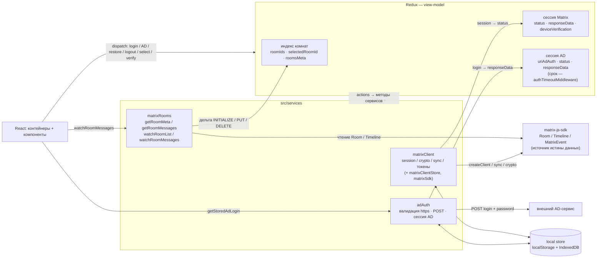
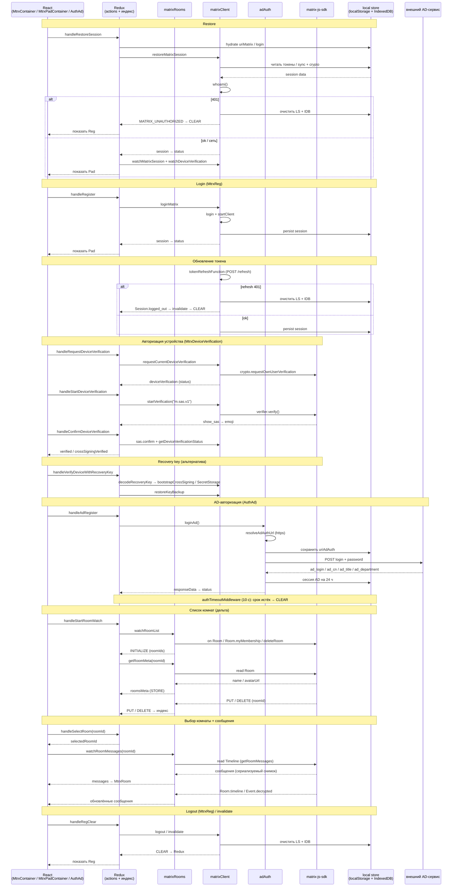

# STATE.md — matrix-react

Архитектура и сценарии работы (диаграммы Mermaid).

## Слои и потоки данных

```mermaid
flowchart LR
  UI["React: контейнеры + компоненты"]

  subgraph Redux["Redux — view-model"]
    IDX["индекс комнат<br/>roomIds · selectedRoomId · roomsMeta"]
    SES["сессия Matrix<br/>status · responseData · deviceVerification"]
    AD["сессия AD<br/>uriAdAuth · status · responseData<br/>(срок — authTimeoutMiddleware)"]
  end

  subgraph SVC["src/services"]
    CL["matrixClient<br/>session / crypto / sync / токены<br/>(+ matrixClientStore, matrixSdk)"]
    ROOMS["matrixRooms<br/>getRoomMeta / getRoomMessages<br/>watchRoomList / watchRoomMessages"]
    ADSV["adAuth<br/>валидация https · POST · сессия AD"]
  end

  SDK["matrix-js-sdk<br/>Room / Timeline / MatrixEvent<br/>(источник истины данных)"]
  ADAPI["внешний AD-сервис"]
  Store[("local store<br/>localStorage + IndexedDB")]

  UI -->|"dispatch: login / AD / restore / logout / select / verify"| Redux
  Redux -->|"actions → методы сервисов"| SVC
  ROOMS -->|"дельта INITIALIZE / PUT / DELETE"| IDX
  CL -->|"session → status"| SES
  ADSV -->|"login → responseData"| AD
  UI -->|"watchRoomMessages"| ROOMS
  UI -->|"getStoredAdLogin"| ADSV
  CL <--> Store
  ADSV <--> Store
  ROOMS -->|"чтение Room / Timeline"| SDK
  CL -->|"createClient / sync / crypto"| SDK
  ADSV -->|"POST login + password"| ADAPI
```

## Сценарии работы

```mermaid
sequenceDiagram
  participant UI as React<br/>(MtrxContainer / MtrxPadContainer / AuthAd)
  participant Redux as Redux<br/>(actions + индекс)
  participant Rooms as matrixRooms
  participant Client as matrixClient
  participant Ad as adAuth
  participant SDK as matrix-js-sdk
  participant Store as local store<br/>(localStorage + IndexedDB)
  participant ADAPI as внешний AD-сервис

  Note over UI,Store: Restore
  UI->>Redux: handleRestoreSession
  Redux->>Store: hydrate uriMatrix / login
  Redux->>Client: restoreMatrixSession
  Client->>Store: читать токены / sync + crypto
  Store-->>Client: session data
  Client->>Client: whoami()
  alt 401
    Client->>Store: очистить LS + IDB
    Client-->>Redux: MATRIX_UNAUTHORIZED → CLEAR
    Redux-->>UI: показать Reg
  else ok / сеть
    Client-->>Redux: session → status
    Redux->>Client: watchMatrixSession + watchDeviceVerification
    Redux-->>UI: показать Pad
  end

  Note over UI,Store: Login (MtrxReg)
  UI->>Redux: handleRegister
  Redux->>Client: loginMatrix
  Client->>Client: login + startClient
  Client->>Store: persist session
  Client-->>Redux: session → status
  Redux-->>UI: показать Pad

  Note over UI,Store: Обновление токена
  Client->>Client: tokenRefreshFunction (POST /refresh)
  alt refresh 401
    Client->>Store: очистить LS + IDB
    Client-->>Redux: Session.logged_out → invalidate → CLEAR
  else ok
    Client->>Store: persist session
  end

  Note over UI,SDK: Авторизация устройства (MtrxDeviceVerification)
  UI->>Redux: handleRequestDeviceVerification
  Redux->>Client: requestCurrentDeviceVerification
  Client->>SDK: crypto.requestOwnUserVerification
  Client-->>Redux: deviceVerification (status)
  UI->>Redux: handleStartDeviceVerification
  Redux->>Client: startVerification("m.sas.v1")
  Client->>SDK: verifier.verify()
  SDK-->>Redux: show_sas → emoji
  UI->>Redux: handleConfirmDeviceVerification
  Redux->>Client: sas.confirm + getDeviceVerificationStatus
  Redux-->>UI: verified / crossSigningVerified

  Note over UI,SDK: Recovery key (альтернатива)
  UI->>Redux: handleVerifyDeviceWithRecoveryKey
  Redux->>Client: decodeRecoveryKey → bootstrapCrossSigning / SecretStorage
  Redux->>Client: restoreKeyBackup

  Note over UI,ADAPI: AD-авторизация (AuthAd)
  UI->>Redux: handleAdRegister
  Redux->>Ad: loginAd()
  Ad->>Ad: resolveAdAuthUrl (https)
  Ad->>Store: сохранить uriAdAuth
  Ad->>ADAPI: POST login + password
  ADAPI-->>Ad: ad_login / ad_cn / ad_title / ad_department
  Ad->>Store: сессия AD на 24 ч
  Ad-->>Redux: responseData → status
  Note over Redux,Store: authTimeoutMiddleware (10 с): срок истёк → CLEAR

  Note over UI,Store: Список комнат (дельта)
  UI->>Redux: handleStartRoomWatch
  Redux->>Rooms: watchRoomList
  Rooms->>SDK: on Room / Room.myMembership / deleteRoom
  Rooms-->>Redux: INITIALIZE (roomIds)
  Redux->>Rooms: getRoomMeta(roomId)
  Rooms->>SDK: read Room
  SDK-->>Rooms: name / avatarUrl
  Rooms-->>Redux: roomsMeta (STORE)
  SDK-->>Rooms: PUT / DELETE (roomId)
  Rooms-->>Redux: PUT / DELETE → индекс

  Note over UI,Store: Выбор комнаты + сообщения
  UI->>Redux: handleSelectRoom(roomId)
  Redux-->>UI: selectedRoomId
  UI->>Rooms: watchRoomMessages(roomId)
  Rooms->>SDK: read Timeline (getRoomMessages)
  SDK-->>Rooms: сообщения (сериализуемый снимок)
  Rooms-->>UI: messages → MtrxRoom
  SDK-->>Rooms: Room.timeline / Event.decrypted
  Rooms-->>UI: обновлённые сообщения

  Note over UI,Store: Logout (MtrxReg) / invalidate
  UI->>Redux: handleRegClear
  Redux->>Client: logout / invalidate
  Client->>Store: очистить LS + IDB
  Client-->>Redux: CLEAR → Redux
  Redux-->>UI: показать Reg
```
