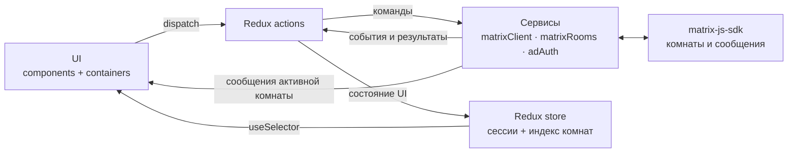
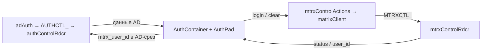
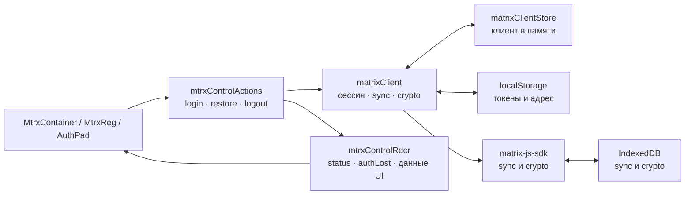
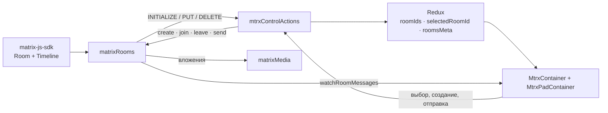

# Архитектура matrix-react

## 1. UI, store и сервисы

Redux хранит состояние интерфейса, а не таймлайн и SDK-объекты. Компоненты не вызывают Matrix API;
прямую подписку на сообщения держит контейнер. `store/configureStore.js` связывает сервисы с
начальным состоянием и зависимостями middleware, не импортируя их в reducers.

## 2. Мост AD ↔ Matrix

`AuthContainer` — единственное место перехода между срезами: thunk-и не диспатчат чужой namespace.
Без сессии видны `AuthLinks`; успех AD показывает `AuthPad`. Тумблер запускает Matrix-вход
данными AD, а при успехе, ошибке или потере Matrix-сессии — сброс. `mtrx_user_id` записывается
в AD-срез только при активной AD-сессии.

## 3. Matrix-авторизация и хранилища

`matrixClient` создаёт и восстанавливает SDK-клиент, проверяет сессию и очищает хранилища при
выходе или инвалидировании. Redux не хранит сам клиент и токены; серверный logout/401
сигнализирует `authLost` через action.

## 4. Matrix-чаты и store

Список и метаданные комнат обновляются в Redux дельтами; сообщения выбранной комнаты идут
напрямую из сервиса в контейнер и в Redux не копируются. Вложения обрабатывает `matrixMedia`.

Интерактивные схемы: [слои приложения](archify/matrix-react-architecture.html),
[мост AD → Matrix](archify/matrix-react-auth-sequence.html),
[чат: последовательность событий](archify/matrix-react-chat-flow.html).
