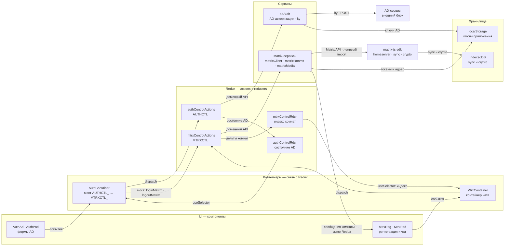
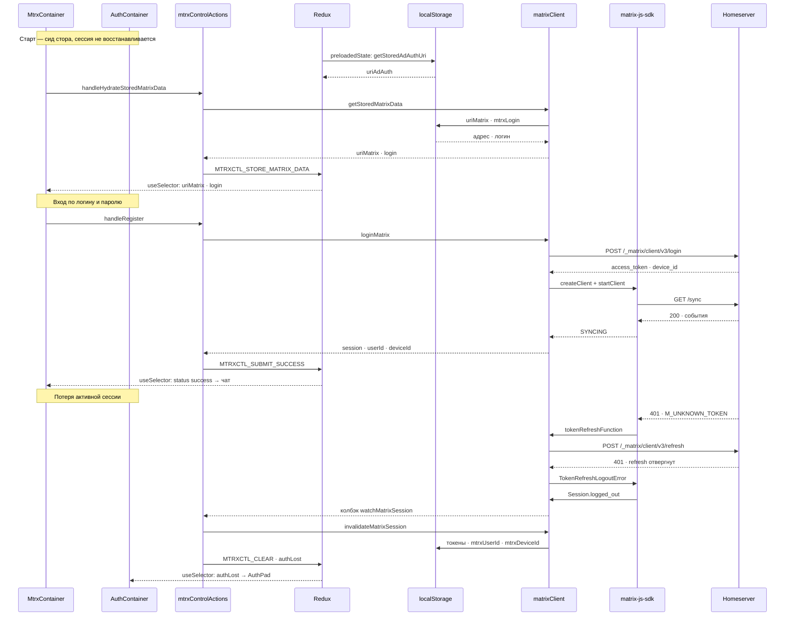
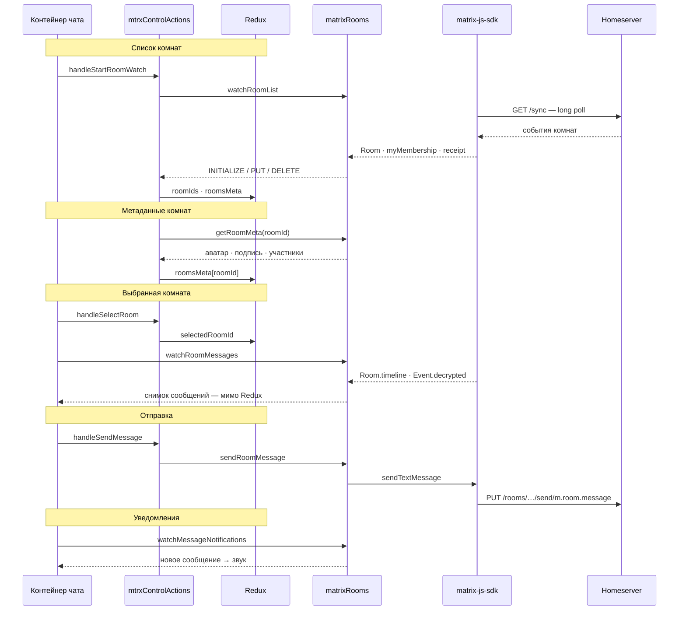
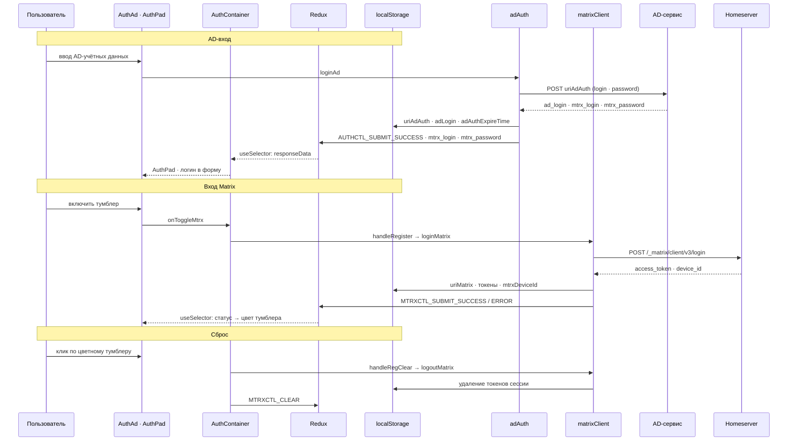
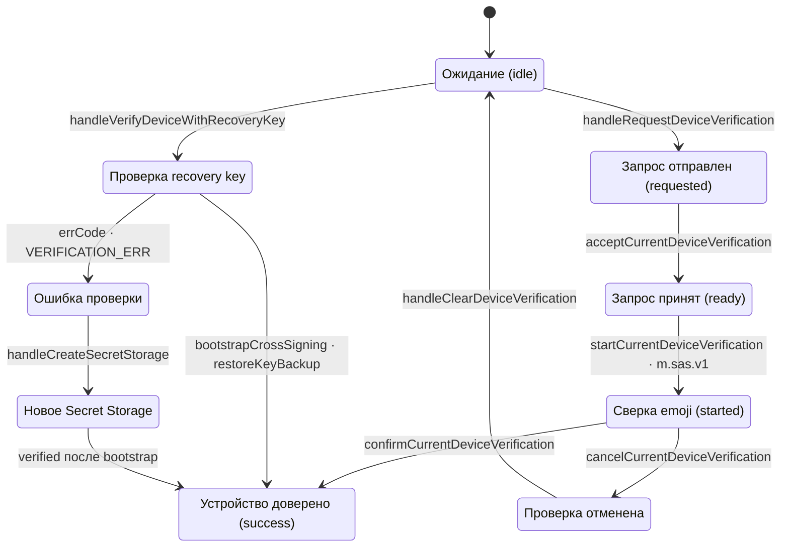

# Архитектура matrix-react

**Правило документации: archify первичен.** Источник истины — интерактивные диаграммы в
[`docs/archify/`](archify/) (JSON-спецификация + собранный HTML). Mermaid-блоки ниже — только
короткий повтор первичной диаграммы (её сообщений и карточек) с комментариями по ключевым
моментам: новых фактов и более подробных потоков в них не появляется. Нужен новый факт — сначала правь archify-спеку и
пересобирай HTML (§ 7), потом повторяй здесь. Полный свод правил проекта — в
[AGENTS.md](../AGENTS.md).

## 1. Архитектура

[Диаграмма](archify/matrix-react-architecture.html) · спека
`archify/matrix-react-architecture.architecture.json`.



- Пунктирные области — слои: UI, контейнеры (связь со store), Redux (`actions` и `reducers`),
  сервисы и хранилище; `AD-сервис` и `matrix-js-sdk` — внешние блоки вне слоёв.
- Срезы `AUTHCTL_` и `MTRXCTL_` идут строками (суффикс в подписях узлов): состояние каждого —
  свой редьюсер (`authControlRdcr`, `mtrxControlRdcr`), а переход между срезами есть только в
  `AuthContainer` (мост); обратный поток (`authLost`, `mtrx_user_id`) идёт через тот же мост.
- У каждого среза свой сервис и внешний ресурс: `AUTHCTL_` → `adAuth` → AD-сервис (`ky`),
  `MTRXCTL_` → Matrix-сервисы → `matrix-js-sdk`; ключи приложения в `localStorage` пишут сервисы
  обоих срезов, sync и crypto — в `IndexedDB`.
- Thunk-и namespace-чистые: `AUTHCTL_` и `MTRXCTL_` не диспатчат чужой срез — мост между ними
  только в `AuthContainer`.
- `matrix-js-sdk` грузится лениво: `import()` в `services/matrixSdk.js` даёт отдельный чанк
  `matrix-sdk`, активный клиент держит `services/matrixClientStore.js`; UI и Redux видят только
  доменный API сервисов, без SDK-объектов.

## 2. Старт и авторизация

[Диаграмма](archify/matrix-react-session-restore.html) · спека
`archify/matrix-react-session-restore.sequence.json`.



- Старт: сохранённые адрес и логин только предзаполняют форму входа; клиент Matrix не создаётся,
  `status` остаётся `idle`, поэтому виден `AuthLinks` — авторизация требуется при каждом запуске.
- Самый ранний доступ к хранилищу — ещё до монтирования React: сид стора
  (`store/preloadedState.js`) читает `uriAdAuth` через `adAuth.getStoredAdAuthUri`; следом
  `startAuthTimeoutCheck` раз в 10 с читает `adAuthExpireTime` и на `AUTHCTL_CLEAR` удаляет его.
- Состояние ведёт срез `mtrxControlRdcr`: гидратация (`MTRXCTL_STORE_MATRIX_DATA`), вход
  (`MTRXCTL_SUBMIT_SUCCESS`) и потеря сессии (`MTRXCTL_CLEAR · authLost`) приходят dispatch'ем,
  а `MtrxContainer` и `AuthContainer` читают их через `useSelector` — прямых стрелок от действий
  к UI в коде нет.
- Вход: `loginMatrix` делает `loginRequest` (POST `/login`, `refresh_token: true`), затем
  `createMatrixClientFromSession` (`createClient` с IndexedDB, crypto и `tokenRefreshFunction`) и
  `startMatrixSync`; `SYNCING` даёт снимок сессии, `status success` включает чат и
  `handleStartRoomWatch`.
- Сохранённый access token для входа не используется: токены нужны активной сессии и
  переиспользованию `deviceId` при следующем входе тем же логином (важно для E2EE).
- Потеря активной сессии (карточка «Потеря активной сессии»): 401 (`M_UNKNOWN_TOKEN`) зовёт
  `tokenRefreshFunction`; принятый refresh обновляет токены без сброса, а 401 на refresh —
  `TokenRefreshLogoutError` → `Session.logged_out` → колбэк `watchMatrixSession` →
  `invalidateMatrixSession` (токены и IndexedDB удалены) → `authLost` → `AuthPad` с красным
  тумблером.

## 3. Чат

[Диаграмма](archify/matrix-react-chat-flow.html) · спека
`archify/matrix-react-chat-flow.sequence.json`.



- Граница Redux: список комнат и выбор — лёгкий индекс (`roomIds`, `selectedRoomId`, `roomsMeta`),
  который обновляется дельтами; сообщения активной комнаты остаются в SDK.
- Две подписки: `watchRoomList` обновляет индекс, `watchRoomMessages` отдаёт таймлайн
  контейнеру напрямую (в том числе по `Event.decrypted`) — сообщения активной комнаты не проходят
  через Redux.
- После каждой дельты действия догружают метаданные комнаты (`getRoomMeta` → `roomsMeta`); они
  приходят асинхронно и не блокируют список.
- Сигнал о новом сообщении даёт сервис (`watchMessageNotifications`), а решение играть звук
  принимает UI — ему нужны фокус окна и видимость комнаты.
- `localStorage` в этом потоке не участвует: `matrixRooms` и `matrixMedia` хранилище не трогают,
  комнаты и сообщения живут в SDK, а индекс — в `mtrxControlRdcr` (поэтому участника
  `localStorage` на диаграмме нет).
- Homeserver участвует через SDK: список и таймлайн приходят из `/sync`, отправка уходит
  `PUT /rooms/…/send/m.room.message`; аватары и медиа — тоже запросы к Homeserver.

## 4. Мост Auth → Чат

[Диаграмма](archify/matrix-react-auth-sequence.html) · спека
`archify/matrix-react-auth-sequence.sequence.json`.



- `AuthContainer` — единственный мост между срезами `AUTHCTL_` и `MTRXCTL_`; пароль AD в Matrix
  Redux не попадает.
- Оба среза сходятся в Redux: `authControlRdcr` принимает `AUTHCTL_SUBMIT_SUCCESS`,
  `mtrxControlRdcr` — `MTRXCTL_SUBMIT_SUCCESS / ERROR` и `MTRXCTL_CLEAR`; цвета тумблера и
  реквизиты AD мост читает из них через `useSelector`.
- Отключённый тумблер запускает вход данными AD; успех, ошибка или потеря сессии — сброс.
- Внешние серверы показаны явно: `adAuth` ходит в AD-сервис (`POST uriAdAuth`), `matrixClient` —
  на Homeserver (`POST /login`, дальше `/sync` через `createClient + startClient`).
- Ключи AD и Matrix ложатся в `localStorage` (`constants/storage.js`); при сбросе токены
  удаляются, адрес и логин остаются, а вместе с токенами чистятся IndexedDB-хранилища `sync` и
  `crypto`.

## 5. E2EE: авторизация устройства

[Диаграмма](archify/matrix-react-device-verification.html) · спека
`archify/matrix-react-device-verification.lifecycle.json`.



- Основной путь: `handleRequestDeviceVerification` ставит `loading`, `requestCurrentDeviceVerification`
  даёт фазу `requested`, `acceptCurrentDeviceVerification` — `ready`,
  `startCurrentDeviceVerification` запускает `m.sas.v1` и показывает emoji;
  `confirmCurrentDeviceVerification` подтверждает SAS, а `verified` приходит с задержкой —
  подпись устройства доезжает crypto-событиями уже после SAS.
- Recovery key: `verifyCurrentDeviceWithRecoveryKey` декодирует ключ, ждёт первый `/sync` и
  сверяет его через `checkKey`; `createNewSecretStorage` создаётся по подтверждению и показывает
  новый `recoveryKey`, а `resetOwnEncryption` по паролю аккаунта делает новую кросс-подпись,
  Secret Storage и ключ.
- Коды `constants/verification.js` выбирают подсказку и следующий шаг: `NO_SECRET_STORAGE` —
  создать хранилище секретов, `CROSS_SIGNING_MISSING` / `RESET_FAILED` — сброс E2EE или запрос с
  другого устройства, `SYNC_INCOMPLETE` — «Повторить», остальные — ввести другой ключ.
- Новый recovery key показывается до конца сессии (`deviceVerification.recoveryKey` в Redux) и в
  `localStorage` не пишется.

## 6. Хранилища

`localStorage` доступен только сервисам; ключи объявлены в `src/constants/storage.js`.
`matrixClient` хранит `uriMatrix`, `mtrxLogin`, `mtrxAccessToken`, `mtrxUserId`, `mtrxDeviceId` и
`mtrxRefreshToken`; `adAuth` — `uriAdAuth`, `adLogin` и `adAuthExpireTime` (срок AD-сессии 24 ч).
Токены нужны активной сессии и переиспользованию `deviceId`, а не для входа при следующем
запуске. При выходе удаляются токены, `mtrxUserId` и `mtrxDeviceId`; recovery key и ключ Secret
Storage живут только в памяти сессии. Вместе с токенами `matrixClient` чистит IndexedDB-хранилища
SDK (`sync` и `crypto`). `IndexedDB` принадлежит `matrix-js-sdk`; в `localStorage` он пишет свои
служебные ключи (например, id фильтра sync), а очередь неотправленных событий попадает туда только
при `pendingEventOrdering: Detached`, который приложение не задаёт.

## 7. Документация archify: первичный источник

Диаграммы собираются навыком `archify`, отрисовка проверяется навыком `archify-visual-check`
(оба — плагин профиля `web`); готовые HTML и JSON руками не правятся.

```bash
ARCHIFY="$HOME/.dsh/profiles/web/node_modules/@tt-a1i/archify-dsh/skills/archify/bin/archify.mjs"

# 1. Приёмка спеки: 9/9 проверок, composition 0 ошибок / 0 предупреждений
node "$ARCHIFY" validate architecture docs/archify/<name>.architecture.json \
  --quality showcase --repo-root . --json

# 2. Сборка: единственная пишущая команда, печатает SHA-256 и байты спеки и артефакта
node "$ARCHIFY" deliver architecture docs/archify/<name>.architecture.json \
  docs/archify/<name>.html --quality showcase --repo-root . --json

# 3. Визуальный контроль: containment и light/dark скриншоты, HTML не меняет
node "$ARCHIFY" visual-check docs/archify/<name>.html --json
```

- Профиль качества — `showcase`; для sequence меняется только тип (`validate sequence`), а
  `--repo-root .` не нужен: поле `meta.repository` есть только у architecture.
- Раскладка артефактов: `<name>.<type>.json` (спека) + `<name>.html` (артефакт) +
  `<name>.visual-check.*` (receipt, скриншоты, contact sheet).
- `visual-check` всегда пишет `visualReview: "pending"`: скриншоты — материал для глаза, а не
  автоматическое подтверждение отрисовки; визуальную приёмку делает навык
  `archify-visual-check`.
- Порядок участников sequence — по [AGENTS.md](../AGENTS.md) п. 4: React-компоненты (`frontend`)
  слева, `localStorage` и reducer рядом, runtime-сервис перед внешними, внешние сервисы
  (`external`) — крайними справа; инициатор-человек остаётся первым.
- Подписи в артефактах — по-русски, как и в этом файле; имена продуктов, команд и API остаются
  английскими.
