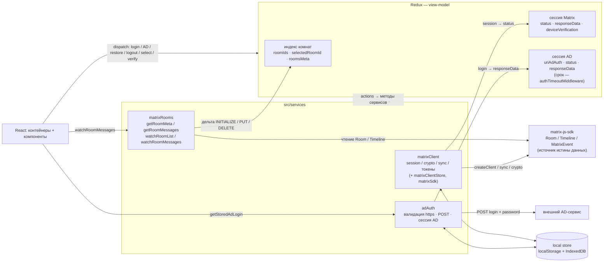
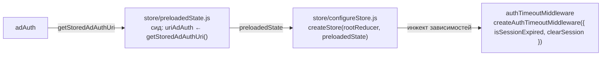
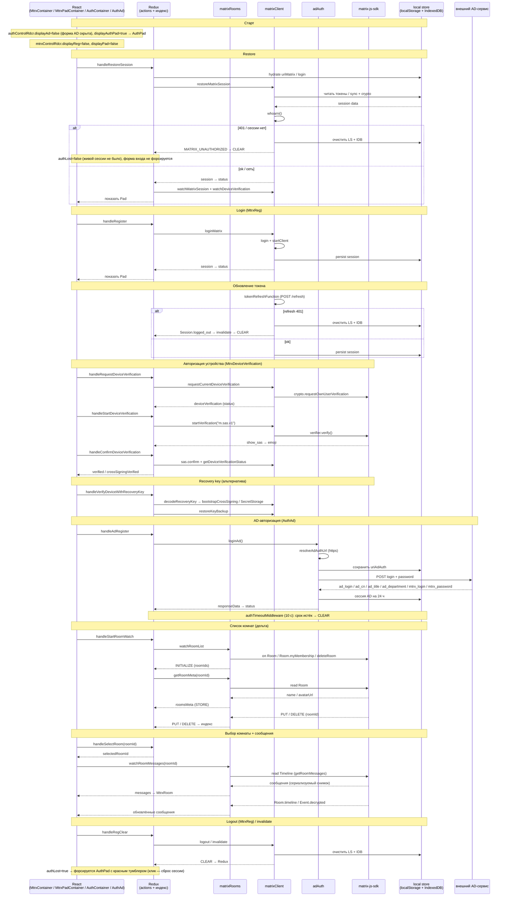
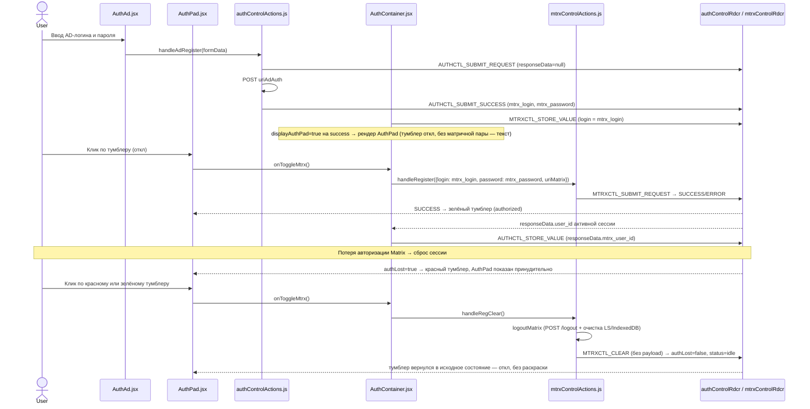

# STATE.md — matrix-react

Архитектура и сценарии работы (диаграммы Mermaid).

## Слои и потоки данных

## Инициализация store

Сервисы со стором сводит только слой стора — reducers и middleware сервисов не импортируют и
остаются чистыми:

- `authControlRdcr` экспортирует чистый `initialState` (только UI-дефолты, без чтения сервисов);
  `preloadedState.js` собирает из него срез и подставляет сохранённый `uriAdAuth`. Срез
  передаётся целиком: `combineReducers` подменяет его, а не мержит с `initialState`.
- `configureStore(preloadedState = getPreloadedState())` — единственное место, где стор сходится
  с сервисами: сид и зависимости `authTimeoutMiddleware` (`isAdAuthSessionExpired` →
  `isSessionExpired`, `clearAdAuthSession` → `clearSession`).
- Тот же `configureStore()` без аргументов вызывает `main.jsx`.

## Сценарии работы

## Мост к сервисам (`AuthContainer`)

Thunk-и namespace-чистые: `authControlActions` не диспатчит `MTRXCTL_`, `mtrxControlActions` —
`AUTHCTL_`. Оба направления моста живут в `AuthContainer`. `AuthPad` рендерится по флагу
`displayAuthPad` (пункт меню «Мост к сервисам», ✕ снимает флаг), который выставляется в `true`
на `AUTHCTL_SUBMIT_SUCCESS` и сбрасывается на `AUTHCTL_CLEAR`; при отсутствии AD-данных `AuthPad`
информирует текстом.

Тумблер `AuthPad` — индикатор состояния сессии Matrix и действие (в MUI `Switch` цвет применяется
к checked-состоянию, поэтому цветной = `checked` + `color`):

| Состояние | Условие | Клик |
| --- | --- | --- |
| откл | сессии нет (`status !== "success"`, `authLost` нет) | автоматическая авторизация данными AD → `handleRegister` |
| зелёный | `mtrxControlRdcr.status === "success"` | сброс сессии → `handleRegClear` |
| красный | `mtrxControlRdcr.authLost` | сброс сессии → `handleRegClear` |

Красный выставляется только вынужденной потерей: `MTRXCTL_CLEAR` приходит с `payload.authLost`
из `watchSessionAndDispatchClear` (принудительный logout сервером / 401). Сброс
(`handleRegClear`) и старт без сессии шлют `CLEAR` без payload, поэтому тумблер возвращается в
исходное состояние — откл, без раскраски. `authLost` сбрасывается на `MTRXCTL_SUBMIT_SUCCESS`;
потеря авторизации вдобавок форсирует показ `AuthPad`.

`AuthContainer` синхронизирует `mtrx_user_id` в `authControlRdcr.responseData` только при активной
AD-сессии (`status === "success"`) — иначе после AD-выхода `responseData` заполнился бы снова.
