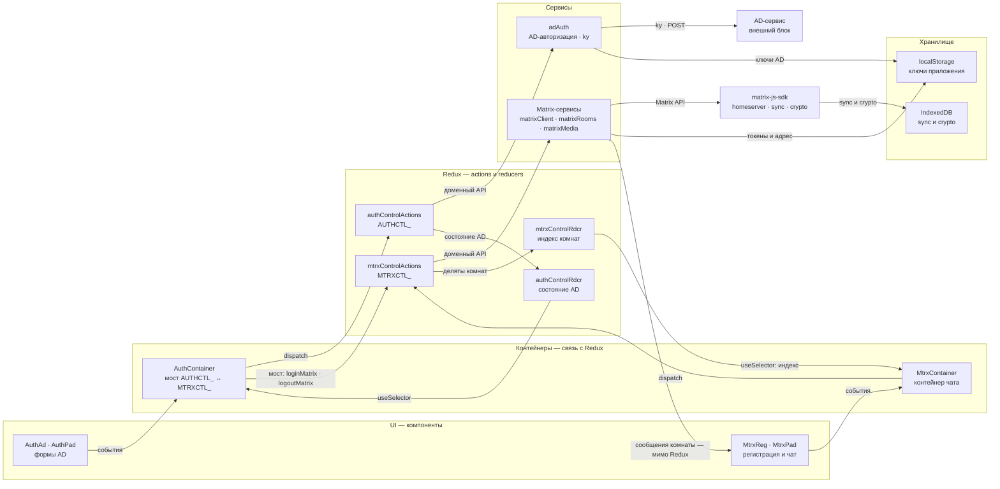
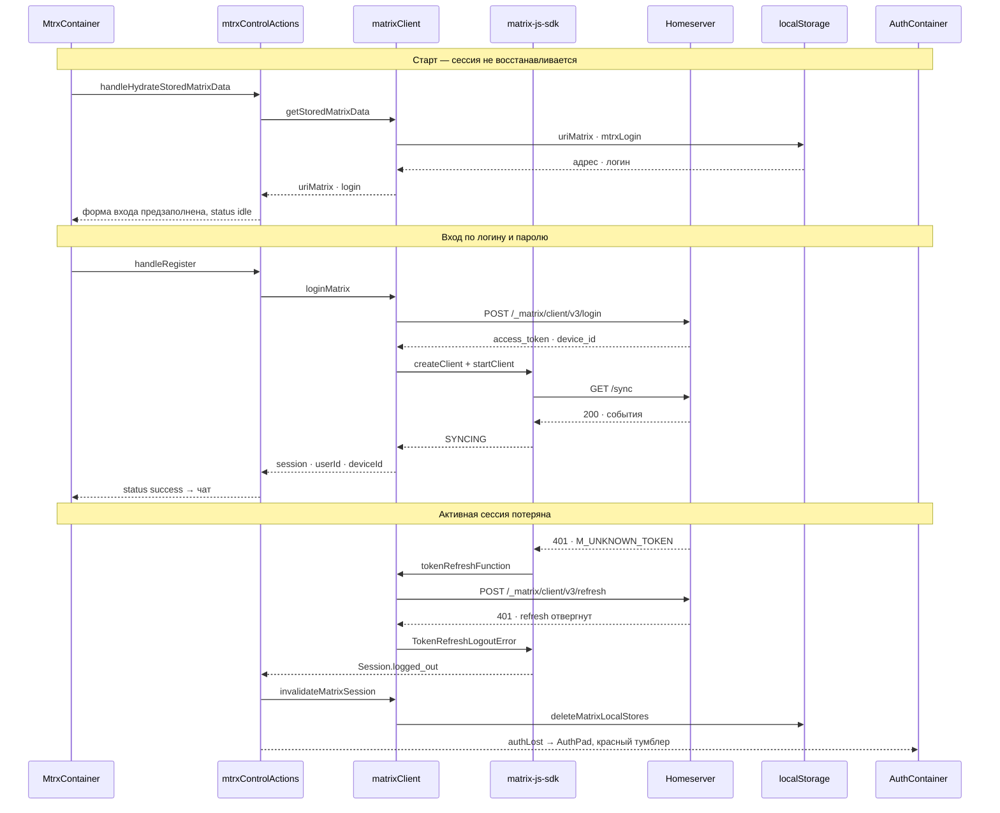
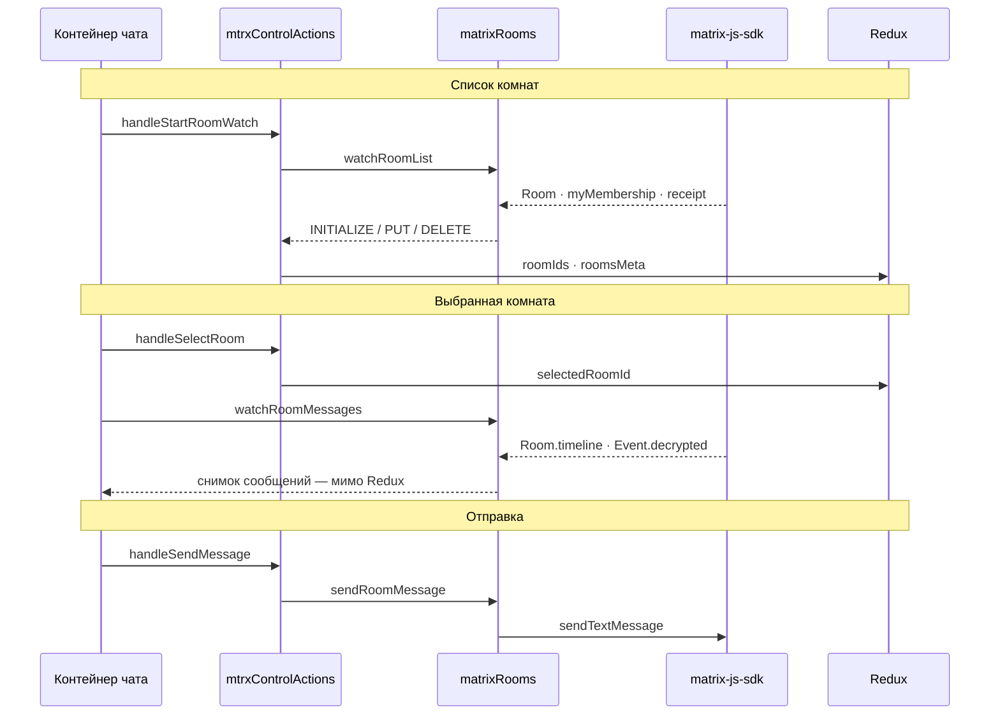
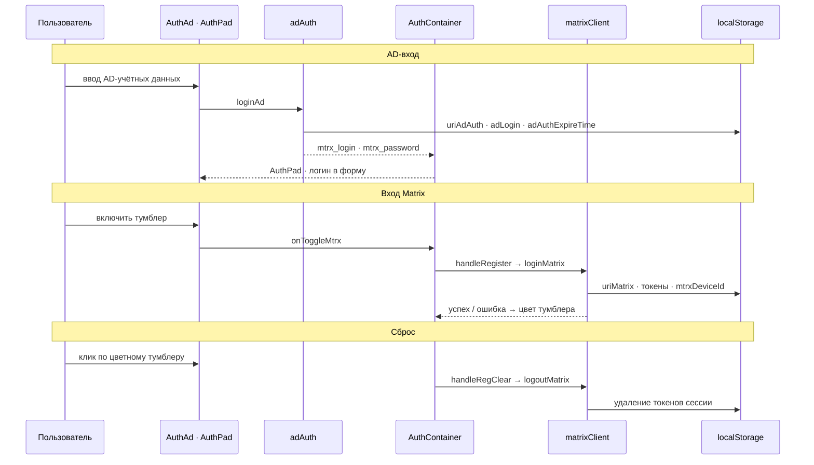

# Архитектура matrix-react

Схемы повторяют интерактивные [archify-диаграммы](archify/matrix-react-architecture.html); под
каждой — краткие пояснения по сути. Полный свод правил — в [AGENTS.md](../AGENTS.md).

## 1. Архитектура

- Пунктирные области — слои: UI, контейнеры (связь со store), Redux (`actions` и `reducers`),
  сервисы и хранилище; `AD-сервис` и `matrix-js-sdk` — внешние блоки вне слоёв.
- Срезы `AUTHCTL_` и `MTRXCTL_` идут строками (суффикс в подписях узлов): состояние каждого —
  свой редьюсер (`authControlRdcr`, `mtrxControlRdcr`), а переход между срезами есть только в
  `AuthContainer` (мост); обратный поток (`authLost`, `mtrx_user_id`) идёт через тот же мост.
- У каждого среза свой сервис и внешний ресурс: `AUTHCTL_` → `adAuth` → AD-сервис (`ky`),
  `MTRXCTL_` → Matrix-сервисы → `matrix-js-sdk`; ключи приложения в `localStorage` пишут сервисы
  обоих срезов, sync и crypto — в `IndexedDB`.

## 2. Старт и авторизация

- Старт: сохранённые адрес и логин только предзаполняют форму входа; клиент Matrix не создаётся,
  `status` остаётся `idle`, поэтому виден `AuthLinks` — авторизация требуется при каждом запуске.
- Сохранённый access token для входа не используется: он нужен только для активной сессии и
  переиспользования `deviceId` при следующем входе тем же логином (важно для E2EE).
- После входа: `SYNCING` даёт снимок сессии, `status success` включает чат и
  `handleStartRoomWatch`; таймлайн остаётся в SDK.
- Потеря активной сессии: 401 (`M_UNKNOWN_TOKEN`) зовёт `tokenRefreshFunction`; принятый refresh
  обновляет токены без сброса, а 401 на refresh — `TokenRefreshLogoutError` →
  `Session.logged_out` → `invalidateMatrixSession` (токены и IndexedDB удалены) → `authLost` →
  `AuthPad` с красным тумблером.

## 3. Чат

- Список комнат и выбор — лёгкий индекс в Redux, который обновляется дельтами.
- Две подписки: `watchRoomList` обновляет индекс, `watchRoomMessages` отдаёт таймлайн
  контейнеру напрямую (в том числе по `Event.decrypted`) — сообщения активной комнаты остаются
  в SDK.

## 4. Мост Auth → Чат

- `AuthContainer` — единственный мост между срезами `AUTHCTL_` и `MTRXCTL_`; пароль AD в Matrix
  Redux не попадает.
- Отключённый тумблер запускает вход данными AD; успех, ошибка или потеря сессии — сброс.
- Ключи AD и Matrix ложатся в `localStorage` (`constants/storage.js`); при сбросе токены
  удаляются, адрес и логин остаются.

## 5. Хранилища

`localStorage` доступен только сервисам: ключи объявлены в `constants/storage.js`, полный список
с владельцами — в [README](../README.md#ключи-localstorage). `matrixClient` хранит адрес, логин и
токены (токены — для активной сессии и переиспользования `deviceId`, а не для входа при
следующем запуске), `adAuth` — адрес сервиса, логин и срок AD-сессии (24 ч). При выходе удаляются
токены, `mtrxUserId` и `mtrxDeviceId`; recovery key не сохраняется. Вместе с токенами
`matrixClient` чистит IndexedDB-хранилища SDK (`sync` и `crypto`). `IndexedDB` принадлежит
`matrix-js-sdk`; в `localStorage` он пишет свои служебные ключи (например, id фильтра sync), а
очередь неотправленных событий попадает туда только при `pendingEventOrdering: Detached`, который
приложение не задаёт.

Интерактивные схемы: [Архитектура](archify/matrix-react-architecture.html),
[Старт и авторизация](archify/matrix-react-session-restore.html),
[Чат](archify/matrix-react-chat-flow.html),
[Мост Auth → Чат](archify/matrix-react-auth-sequence.html).
